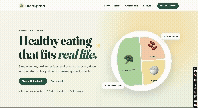

# 🥗 HealthyPlate

**HealthyPlate** is a healthy eating blog made to help beginners learn how to eat healthier without making it feel confusing or difficult. The website explains what healthy eating is, what a balanced meal can look like, and why different foods are important. It also shares simple recipes, healthy meal ideas, grocery tips, and helpful information about different ingredients.HealthyPlate is not about following a strict diet or eating perfectly. It is about learning how to make healthier choices, trying different foods, and building healthy habits that can work in everyday life.

The project focuses on **balance, variety, education, and realistic habits**—not strict dieting or food guilt.

## Features

- Healthy Eating 101 guides covering balanced meals and nutrition basics
- Collection of 100 searchable recipes with category filters, more to be added in the future.
- Recipe pages with ingredients, instructions, timing, servings, and nutrition context
- Interactive grocery checklist and practical budget tips
- Flexible eating-pattern overview
- Curated links to established public-health and academic resources
- OpenAI-powered meal-idea assistant with input validation and a safe offline state
- Responsive, accessible interface with mobile navigation and reduced-motion support
- Custom 404 page and Flask application factory for easier testing


## Demo Walkthrough



## ⚙️ Tech stack
* Python 3 — Handles application logic and content management.
* Flask — Manages routing, requests, templates, and server-side rendering.
* Jinja — Creates reusable page layouts and displays dynamic content.
* HTML5, CSS3, and JavaScript — Handles page structure, responsive design, accessibility, and mobile navigation.
*  OpenAI Responses API — Provides an optional beginner-friendly meal idea assistant.
* Configuration - `python-dotenv` — Loads local environment variables from the `.env` file.
* Python `unittest` and Flask test client — Tests routes, filters, validation, and error handling.
* Google Fonts — Provides DM Sans and Fraunces typography.


## Local setup

1. Move into the project:

   ```bash
   cd aiprojects/healthyplate
   ```

2. Create and activate a virtual environment:

   ```bash
   python3 -m venv .venv
   source .venv/bin/activate
   ```

3. Install dependencies:

   ```bash
   python -m pip install -r requirements.txt
   ```

4. Create your local environment file:

   ```bash
   cp .env.example .env
   ```

5. Add an OpenAI API key to `.env` if you want to enable the assistant. The rest of the site works without one.

6. Start the development server:

   ```bash
   python main.py

The tests cover core pages, recipe filtering, missing recipes, assistant validation, and behavior when no API key is configured.

7. Open `http://127.0.0.1:5000`.

## Tests

Run the route and behavior tests with:

```bash
python -m unittest discover -s tests -v

```
## 🚀 Future Features

- Personalized meal recommendations
- Weekly meal planning
- Automatic grocery lists
- Recipe ratings
- Recipe comments
- Dietary preference filters
- Seasonal recipe collections
- Newsletter subscriptions
- Meal-of-the-week recommendations
- Beginner healthy-eating challenges

## 🌱 Content Guidelines

HealthyPlate content should be:

* Easy to read and understand
* Friendly and welcoming to everyone
* Respectful of different cultures, budgets, diets, and food preferences
* Focused on balance instead of calling foods “good” or “bad”
* Helpful for everyday things like grocery shopping, cooking, and planning meals
* Clear about when someone should talk to a healthcare professional

## ⚠️ Health Disclaimer

HealthyPlate is made to help people learn more about healthy eating. The information on the website is for general education and should not replace advice from a doctor or dietitian. Everyone’s nutrition needs are different. If someone has specific health concerns, allergies, dietary needs, or questions about their health, they should talk with a qualified healthcare professional.


**HealthyPlate — Learn better. Eat balanced. Start simple.**
